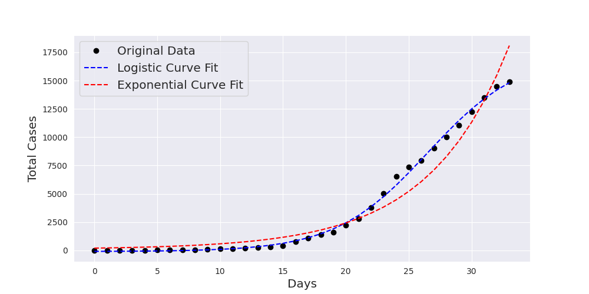
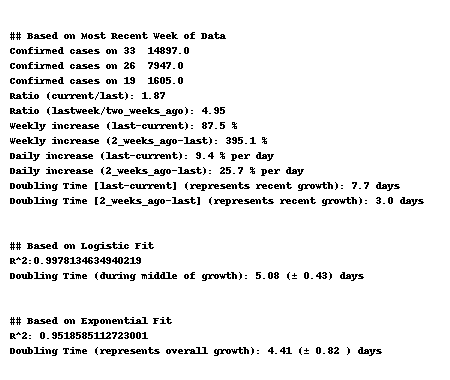
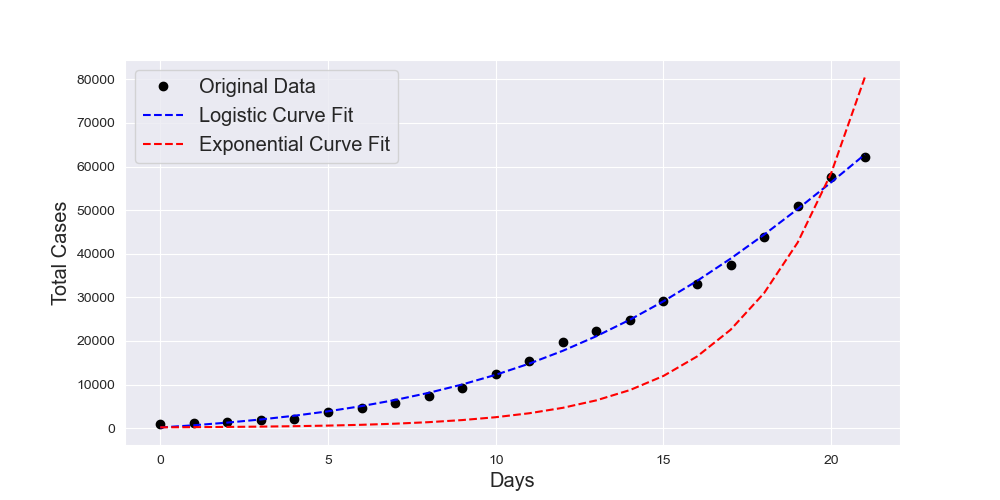
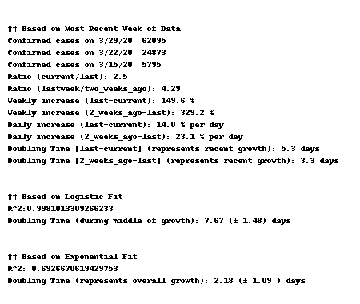
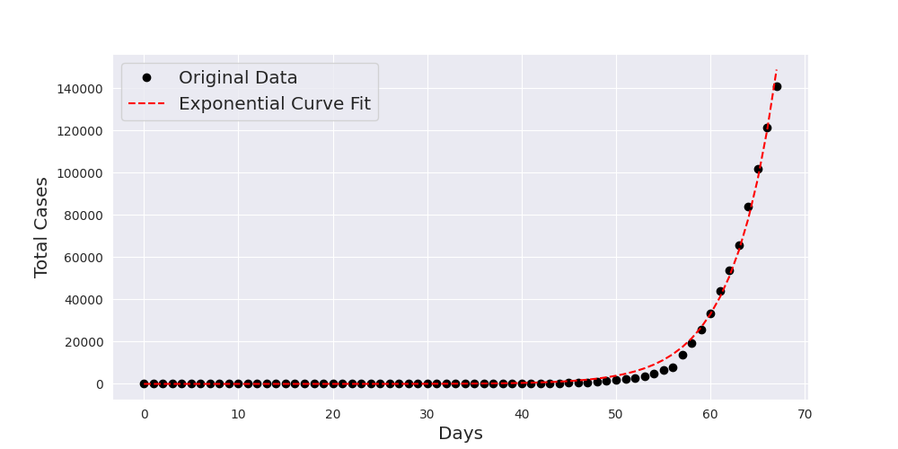
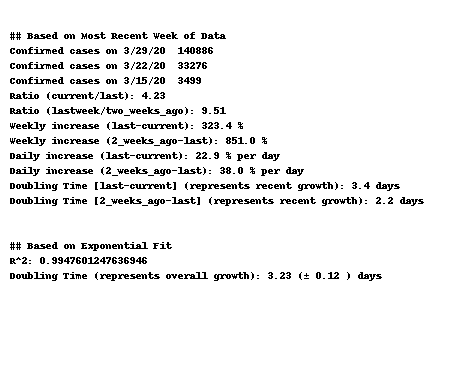
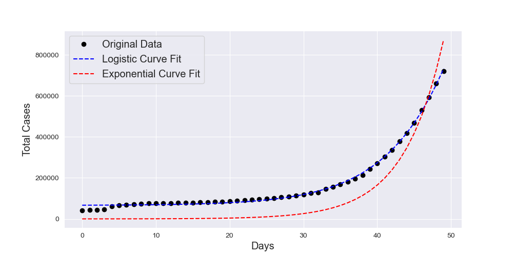
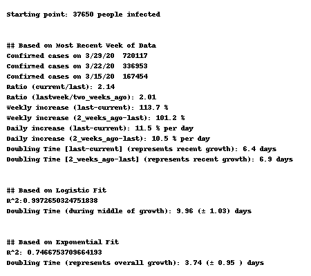

# Tracking the Growth of COVID-19 Cases in Switzerland, Germany and World Wide

The purpose of page is to infer the rate at which confirmed cases of COVID-19 are growing (or were growing) in various countries.

The notebook pulls data from the John Hopkins [Data Repository](https://github.com/CSSEGISandData/COVID-19) of global Coronavirus COVID-19 cases, and then does the following things:

- List total number of confirmed cases (in countries with at least 100 cases)
- Attempt to fit the time series of confirmed cases in these countries to both an exponential and a logistic function
- Use these curve fits to infer doubling times (i.e., time for the number of confirmed cases to double)
- If the curve fit was successful, summarize doubling times for each country

The data for Switzerland are pulled from [daenuprobst repo](https://github.com/daenuprobst/covid19-cases-switzerland).

Original code from https://github.com/aatishb/covid

The starting point of the figure is the first day where the prevalence > 0.05 per 10'000 inhabitants.

# Switzerland

# Germany

# US

# World Wide

